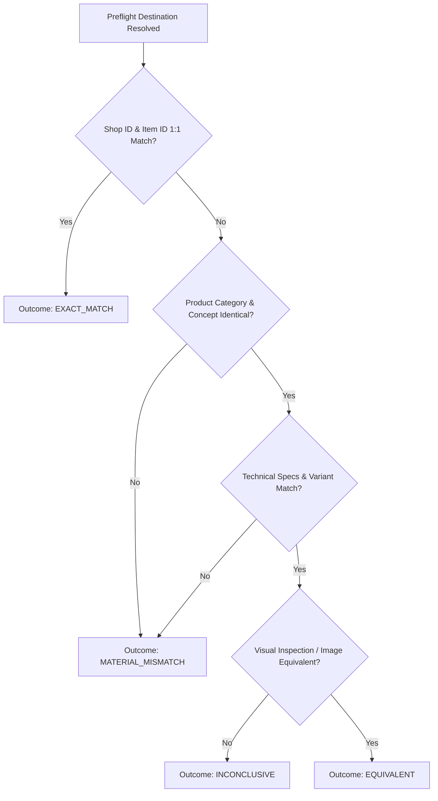

# SPEC-019 — Two-Stage Product Identity & Affiliate Reconciliation

**Status:** PROPOSED · G1 SCOPE AUTHORIZATION ONLY (DESIGN AMENDED) · IMPLEMENTATION NOT AUTHORIZED

**Starting Baseline:** `d8a1388bfce85b3a22f81916fb4c056fb92c0b13` (Branch: `feature/spec-015-admin-cockpit-ux-ui`)

**Target Scope:** Engineering Specification for Two-Stage Product Identity, Affiliate Reconciliation, and Affiliate-Panel-Assisted Discovery Contract.

---

## 1. Problem Statement

Garimora enforces a strict identity contract:
$$\text{DISCOVERED Shop ID + Item ID} = \text{AFFILIATE DESTINATION Shop ID + Item ID}$$

This strict 1:1 identity contract successfully protected catalog integrity during the Pilot #001 launch. However, during Catalog Expansion v1 (Batch 02), 6 out of 9 prepared candidate products (66.6% of candidates) generated a `FAIL_IDENTITY_MISMATCH` preflight status.

Diagnostic investigations of representative cases (`CAND-B2-FERR` and `CAND-C1-CASA`) established:
1. **Deterministic Redirects:** The HUMAN-provided affiliate links (`s.shopee.com.br/...`) deterministically resolve to a specific alternate `Shop ID` + `Item ID` pair in 100% of test runs.
2. **Valid Destination PDPs:** The destination URLs load valid, active Shopee Product Detail Pages (PDPs).
3. **Same Product Concept:** The destination pages represent the exact same product concept and physical item type (e.g., Fita Nano Gel 3m, Papa Bolinhas Elétrico USB), but sold by a different seller or under a separate listing identifier.
4. **Active Original Listing:** In case C1, the original discovered listing remained live and active while the affiliate destination listing was also live and active.
5. **Lack of Official Documentation:** Public official Shopee documentation does not document automatic seller substitution or dynamic stock re-routing.

Garimora cannot assume unverified platform behaviors or silently relax identity validation. Concurrently, discarding valid monetizable links that point to the exact same product concept creates unsustainable operational friction.

Furthermore, Garimora must avoid long-term operational dependency on manual link handoffs. Future Product Discovery will support **Affiliate-Panel-Assisted Discovery** through a HUMAN-authenticated Shopee Affiliate session without compromising security or Two-Stage Identity safeguards.

---

## 2. Goals & Non-Goals

### Goals
- **Two-Stage Identity Preservation:** Formally decouple and preserve both `DISCOVERED_IDENTITY` (origin provenance) and `MONETIZABLE_IDENTITY` (affiliate destination), ensuring neither is silently lost or blindly trusted.
- **Deterministic Reconciliation Engine:** Define a fail-closed, multi-tier reconciliation matrix (`EXACT_MATCH`, `EQUIVALENT`, `MATERIAL_MISMATCH`, `INCONCLUSIVE`) to evaluate candidate identity alignment based on technical specifications, product type, and visual/textual evidence.
- **Commercial Data Disambiguation:** Explicitly separate structural identity attributes (product type, capacity, variant) from commercial observations (price, stock, promotions). Ensure published commercial data is freshly observed from the monetizable destination.
- **Affiliate Link Acquisition Abstraction:** Support multiple acquisition origins (`HUMAN_PROVIDED` and `AFFILIATE_PANEL_ASSISTED`) without coupling persistence to manual chat handoffs.
- **Affiliate-Panel-Assisted Discovery Contract:** Define security boundaries and lifecycle integration for future HUMAN-authenticated affiliate session discovery.
- **Fail-Closed Publication Gate Integration:** Integrate Two-Stage Reconciliation as a mandatory prerequisite for the Publication Gate, keeping all existing safety checks intact.
- **Seamless Backward Compatibility:** Ensure existing 1:1 ACTIVE products (Pilot #001, A1, A3, B1) operate seamlessly under the new model without data corruption or re-verification failures.
- **Safe Re-Evaluation Pipeline:** Define a clear, step-by-step pipeline for re-evaluating the 6 blocked candidates (`CAND-A2-CASA`, `B2`, `B3`, `C1`, `C2`, `C3`) under strict HUMAN authorization.

### Non-Goals
- **No Un-Authorized Implementation:** This SPEC does NOT authorize code implementation, database mutations, schema migrations, or production deployments under G1.
- **No Browser Automation / Shopee Access in SPEC-019:** Browser automation for Shopee Affiliate login/panel interactions is explicitly DEFERRED to a future specification (e.g. SPEC-020). SPEC-019 defines the identity and reconciliation contract only.
- **No Credentials Handling by Agent:** Agents will never request, receive, store, or handle user passwords, 2FA codes, or CAPTCHA solutions.
- **No Automatic Candidate Approval:** Adopting Two-Stage Identity or Affiliate-Panel-Assisted Discovery does NOT automatically unblock or activate the 6 blocked candidates.
- **No Amazon Integration:** Amazon remains outside the scope of this specification.

---

## 3. Terminology

- **Discovered Identity:** The marketplace, shop/seller ID, item ID, and source canonical URL captured during initial Product Discovery.
- **Monetizable Identity:** The marketplace, shop/seller ID, item ID, and destination canonical URL obtained by expanding the official `AffiliateLink`.
- **Link Acquisition Origin:** Operational provenance indicating how the affiliate link was acquired (`HUMAN_PROVIDED` vs `AFFILIATE_PANEL_ASSISTED`).
- **Identity Reconciliation:** The formal, deterministic process of comparing `Discovered Identity` and `Monetizable Identity` to establish product equivalence.
- **Exact Match (`EXACT_MATCH`):** Identity state where `Discovered Shop ID == Monetizable Shop ID` AND `Discovered Item ID == Monetizable Item ID`.
- **Equivalent (`EQUIVALENT`):** Identity state where `Shop ID` or `Item ID` differ, but empirical evidence confirms the listing represents the exact same physical product concept, specification, and utility.
- **Material Mismatch (`MATERIAL_MISMATCH`):** Identity state where the monetizable destination points to a different product concept, variant, capacity, or utility.
- **Inconclusive (`INCONCLUSIVE`):** Identity state where available telemetry or page metadata is insufficient to establish equivalence with certainty.
- **Commercial Observation:** Dynamic commercial state (price, discount, stock, shipping) captured from the destination PDP.

---

## 4. Two-Stage Identity & Affiliate-Panel-Assisted Discovery

### 4.1 Affiliate-Panel-Assisted Discovery Conceptual Lifecycle

When authorized in a future specification, discovery will operate via an authenticated affiliate session under strict HUMAN intervention gates:

```
[HUMAN Authorizes Discovery Session]
                │
                ▼
[Agent Opens Shopee Affiliate Panel]
                │
        (Authentication Required?)
       /                          \
     Yes                           No
     /                              \
[HUMAN_INTERVENTION_REQUIRED]     [Session Available]
(HUMAN logs in, solves 2FA/CAPTCHA)         │
     │                                     │
     └──────────────────┬──────────────────┘
                        │
                        ▼
    [Agent Searches/Inspects Eligible Items]
                        │
                        ▼
      [Capture DISCOVERED_IDENTITY (Stage 1)]
                        │
    [Generate/Extract Official Affiliate Link]
                        │
    [Affiliate Destination Preflight Check]
                        │
      [Capture MONETIZABLE_IDENTITY (Stage 2)]
                        │
       [Identity Reconciliation Engine]
                        │
         +--------------+--------------+
         │                             │
   [EXACT / EQUIVALENT]     [MISMATCH / INCONCLUSIVE]
         │                             │
   [Publication Gate]        [BLOCKED / HUMAN REVIEW]
         │
   [ACTIVE Catalog]
```

### 4.2 Security Rules for Affiliate Session

1. **Strict Credential Isolation:** The agent MUST NOT request, accept, or store passwords, 2FA tokens, or session secrets. All authentication, CAPTCHA solving, and 2FA input are strictly HUMAN interventions.
2. **No Secret Persistence:** Session secrets, cookies, or credentials MUST NEVER be written to plain-text `.env` files, task log files, or project handoff documents.
3. **No Unrestricted Execution:** An active authenticated session DOES NOT constitute open authorization for autonomous agent execution. Every execution remains bound to explicit HUMAN scope authorization.
4. **No Financial/Account Alterations:** Agents MUST NOT modify account settings, payout parameters, or affiliate profile data.

### 4.3 Mandatory Two-Stage Identity Rule

Finding a product inside an authenticated Shopee Affiliate Panel **DOES NOT** eliminate Two-Stage Identity or Destination Preflight. The rule remains invariant:
$$\text{"Found inside Affiliate Panel"} \neq \text{"Safe to publish"}$$

Every candidate discovered via `AFFILIATE_PANEL_ASSISTED` discovery MUST still undergo complete Destination Preflight and Identity Reconciliation before entering the Publication Gate.

---

## 5. Domain Contracts & Reconciliation Rules

### 5.1 Identity Attributes vs. Commercial Observations

| Category | Attributes / Metrics | Role in Reconciliation |
| :--- | :--- | :--- |
| **Structural Identity Attributes** | Product Category, Generic Title Concept, Key Technical Specs (voltage, length, material), Primary Product Images, Model/Variant Identifier | **Mandatory Equivalence Check**. Must match 1:1 or be demonstrably identical in physical utility. |
| **Commercial Observations** | Current Price, Discount Percentage, In-Stock Status, Seller Rating, Shipping Fee, Coupon Availability | **Excluded from Identity Match**. Fresh commercial observations are captured from Monetizable Identity for publication. |

### 5.2 Reconciliation Decision Matrix



#### Detailed Rule Table

| Discovered vs. Monetizable State | Empirical Evidence Criteria | Reconciliation Outcome | Publication Gate Action |
| :--- | :--- | :--- | :--- |
| **Shop ID & Item ID Match** | Discovered `(ShopA, Item1)` == Monetizable `(ShopA, Item1)` | `EXACT_MATCH` | Proceed to 9/9 Gate |
| **Same Concept, Different Seller** | Same category, identical title concept, identical specs, equivalent product images | `EQUIVALENT` | Proceed to 9/9 Gate (with Monetizable Commercial Data) |
| **Different Variant / Size / Capacity** | Same seller or product family, but different capacity (e.g. 5m tape vs 3m tape; 100ml vs 200ml) | `MATERIAL_MISMATCH` | **BLOCKED** |
| **Materially Different Product** | Completely different product concept (e.g. wooden sconce vs LED bar) | `MATERIAL_MISMATCH` | **BLOCKED** |
| **Ambiguous Metadata / Anti-Bot Block** | Destination PDP cannot be fully inspected or metadata is conflicting | `INCONCLUSIVE` | **BLOCKED** (Requires Human Audit) |
| **Destination Unavailable / 404** | Destination URL yields 404, 500, or invalid redirect | `DESTINATION_UNAVAILABLE` | **BLOCKED** |

---

## 6. Fail-Closed Principles

The Two-Stage Identity Contract strictly enforces fail-closed operations:
1. **Uncertainty = Blocked:** `INCONCLUSIVE` outcomes CANNOT be automatically published by AI agents.
2. **Material Mismatch = Blocked:** Any deviation in technical capacity, size, model, or function automatically halts publication.
3. **No Silent Price Override:** Price shown on Garimora storefront MUST reflect the fresh `PriceObservation` from the monetizable destination.
4. **No Unverified Destinations:** Candidate cannot enter `READY` or `ACTIVE` without a successful preflight execution.

---

## 7. State Machine Architecture

Candidate identity status is managed independently from core `ProductStatus` (`DRAFT`, `READY`, `ACTIVE`, `PAUSED`, `ARCHIVED`).

```
[Candidate Lifecycle]
DISCOVERED (via HUMAN_PROVIDED or AFFILIATE_PANEL_ASSISTED)
    │
    ▼
DESTINATION_PREFLIGHT_PENDING
    │
    ├─────────────────────────────┐
    ▼ (Preflight Success)          ▼ (Preflight Failure / HTTP 404)
DESTINATION_VERIFIED          DESTINATION_UNAVAILABLE (BLOCKED)
    │
    ▼
RECONCILIATION_PENDING
    │
    ├─────────────────────────────┬─────────────────────────────┐
    ▼ (Specs & Concept Match)     ▼ (Different Spec/Concept)    ▼ (Ambiguous Telemetry)
RECONCILED_EXACT              MATERIAL_MISMATCH (BLOCKED)   INCONCLUSIVE (BLOCKED)
RECONCILED_EQUIVALENT
    │
    ▼
PUBLICATION_ELIGIBLE
    │
    ▼ (Publication Gate Pass)
PRODUCT_ACTIVE
```

---

## 8. Data Model Analysis & Persistence Proposals

Four schema architectural alternatives were evaluated:

### Option A: Extend Existing `products` and `affiliate_links` Tables (Minimal Additive)
Add discovered identity columns to `products` and destination metadata + acquisition origin (`linkOrigin: HUMAN_PROVIDED | AFFILIATE_PANEL_ASSISTED`) to `affiliate_links`.
- **Benefits:** Lowest complexity, zero new tables, simple SQL queries.
- **Costs:** Mixes candidate discovery telemetry with published product domain.
- **Migration Impact:** Minimal.

### Option B: Dedicated `product_identities` Table (Clean Separation)
Create a table `product_identities` storing discovered identity, monetizable identity, reconciliation logs, and link acquisition origin.
- **Benefits:** High auditability, clear separation of concerns, clean domain model.
- **Costs:** Requires additional JOINs for admin queries.
- **Migration Impact:** Low (New table).

### Option C: Separate `product_candidates` Staging Table
Keep discovery entirely in a staging table `product_candidates`, transferring to `products` only upon publication.
- **Benefits:** Total isolation of staging data.
- **Costs:** High refactoring cost.
- **Migration Impact:** High.

### Option D: Hybrid Two-Stage Identity Schema (RECOMMENDED)
Extend `products` with explicit discovery fields (`discovery_shop_id`, `discovery_item_id`, `discovery_canonical_url`) and `affiliate_links` with monetizable identity fields (`destination_shop_id`, `destination_item_id`, `destination_canonical_url`, `reconciliation_status`, `link_origin`).

#### Recommended Hybrid Schema Definition (For Future G2 Authorization)
```typescript
// Proposed addition to src/db/schema.ts (NOT EXECUTED IN G1)
export const reconciliationStatus = pgEnum("reconciliation_status", [
  "EXACT_MATCH",
  "EQUIVALENT",
  "MATERIAL_MISMATCH",
  "INCONCLUSIVE",
  "DESTINATION_UNAVAILABLE"
]);

export const linkOrigin = pgEnum("link_origin", [
  "HUMAN_PROVIDED",
  "AFFILIATE_PANEL_ASSISTED"
]);

// Additions to products table:
// discoveryMarketplaceId, discoveryShopId, discoveryItemId, discoveryCanonicalUrl

// Additions to affiliate_links table:
// destinationShopId, destinationItemId, destinationCanonicalUrl, reconciliationStatus, linkOrigin, reconciledAt
```

*(Note: The link acquisition origin `link_origin` can also be stored as provenance JSON metadata; schema addition is non-breaking and additive).*

---

## 9. Backward Compatibility & Existing Baseline

Current production baseline consists of **4 ACTIVE Products**:
1. `Pilot #001` (Cortador e Ralador Multiuso)
2. `CAND-A1-ORG` (Kit 10 Suportes Adesivos)
3. `CAND-A3-COZ` (Dispenser Detergente 2 em 1)
4. `CAND-B1-FERR` (Trena Laser Digital 18m)

### Compatibility Rule
Existing products passed the 1:1 strict identity check ($\text{Discovered Shop/Item ID} == \text{Destination Shop/Item ID}$).

Under Two-Stage Identity:
$$\text{discovery\_shop\_id} = \text{destination\_shop\_id}$$
$$\text{discovery\_item\_id} = \text{destination\_item\_id}$$
$$\text{reconciliation\_status} = \text{'EXACT\_MATCH'}$$
$$\text{link\_origin} = \text{'HUMAN\_PROVIDED'}$$

Legacy active products are automatically categorized as `EXACT_MATCH`. **No re-verification or database migration script will alter their ACTIVE status.**

---

## 10. Blocked Candidate Re-Evaluation Pipeline

The 6 currently BLOCKED candidates (`CAND-A2-CASA`, `B2`, `B3`, `C1`, `C2`, `C3`) will be processed through a 5-step re-evaluation pipeline **only after G2 execution authorization**:

```
[Step 1: Destination Preflight] -> Resolve short link & extract destination Shop/Item ID
[Step 2: Metadata Extraction] -> Extract PDP title, specs, image, and price
[Step 3: Identity Reconciliation] -> Execute decision matrix -> Outcome (EQUIVALENT / MISMATCH)
[Step 4: Price Observation] -> Record fresh PriceObservation from destination PDP
[Step 5: Publication Gate Review] -> Submit to 9/9 Gate for Human Approval
```

---

## 11. Publication Gate Composition

Two-Stage Identity Reconciliation integrates into the existing Publication Gate as **Prerequisite Step 0**:

1. **Step 0: Identity Reconciliation Gate (NEW)**
   - Destination Preflight: `PASS`
   - Destination URL HTTP Status: `200`
   - Reconciliation Status: `EXACT_MATCH` OR `EQUIVALENT`
2. **Step 1–9: Standard Publication Gate (EXISTING)**
   - 1. Marketplace Active
   - 2. Category Active & Linked
   - 3. Title & Editorial Notes Valid
   - 4. Product Image Status 200 & Dimensions Valid
   - 5. Active Affiliate Link Present
   - 6. Fresh Price Observation Present (from Destination)
   - 7. Required Tags Present
   - 8. SEO Slug Unique & Valid
   - 9. Status Transition Authorization

---

## 12. Security, Privacy & Affiliate Safety

- **Zero PII & Fingerprinting:** Destination preflight execution captures NO personal data, cookies, or browser fingerprints.
- **Strict Credential Isolation:** Agent will never request, receive, store, or log passwords, 2FA tokens, or session secrets.
- **No Open Redirects:** All `/go` endpoints strictly validate destination domain (`shopee.com.br` or `s.shopee.com.br`).
- **Affiliate Parameter Integrity:** Garimora never fabricates or manually alters affiliate parameters (`mmp_pid`, `uls_trackid`, `sub_id`).
- **Append-Only Telemetry:** `click_events` remain strictly append-only.

---

## 13. Revalidation & Identity Drift Monitoring

If an ACTIVE product's affiliate link later changes destination or becomes unavailable:
1. **Drift Detection:** Periodic async health check expands active short links.
2. **Drift Alert:** If destination `Shop ID` + `Item ID` changes post-publication, reconciliation status transitions to `RECONCILIATION_PENDING`.
3. **Grace Period & Pause:** Product status transitions to `PAUSED` if destination resolves to a `MATERIAL_MISMATCH` or HTTP `404`.

---

## 14. Architecture Decision Record (ADR-008 Proposal)

An ADR proposal has been authored at [`docs/adr/ADR-008-two-stage-product-identity.md`](file:///c:/Users/Samsung/Desktop/Garimora/site-de-afiliados/docs/adr/ADR-008-two-stage-product-identity.md) establishing:
- **Title:** Two-Stage Product Identity & Affiliate Reconciliation Framework
- **Status:** PROPOSED (Amended for Affiliate-Panel-Assisted Discovery · Awaiting G2 Authorization)
- **Decision:** Adopt Two-Stage Identity decoupling discovery origin from monetizable affiliate destination with a fail-closed reconciliation engine, abstracting link acquisition origin (`HUMAN_PROVIDED` vs `AFFILIATE_PANEL_ASSISTED`).

---

## 15. Test Strategy (Pre-Implementation Plan)

Prior to G2 code execution, unit and integration test suites must cover 15 scenarios:
1. 1:1 Exact Shop ID & Item ID match (`EXACT_MATCH`).
2. Same product concept & specs, different seller (`EQUIVALENT`).
3. Same title, different size/variant (`MATERIAL_MISMATCH`).
4. Same product, different quantity (`MATERIAL_MISMATCH`).
5. Same product, different capacity (`MATERIAL_MISMATCH`).
6. Visually distinct item (`MATERIAL_MISMATCH`).
7. Original discovery PDP 404 (`EQUIVALENT` allowed if destination valid).
8. Monetizable destination 404 (`DESTINATION_UNAVAILABLE`).
9. Anti-bot verification error on destination (`INCONCLUSIVE`).
10. Malformed short link (`DESTINATION_UNAVAILABLE`).
11. Commercial price change only (`EQUIVALENT` + Price Update).
12. Legacy 1:1 ACTIVE product preservation (`EXACT_MATCH`).
13. Re-evaluation of blocked candidates.
14. Fail-closed rejection of `INCONCLUSIVE` states.
15. Publication Gate Step 0 integration.

---

## 16. Proposed Implementation Plan (Phased Execution for G2)

- **Phase 1: Schema Extension & Migration (DRY RUN)**
  - Extend schema definitions in `src/db/schema.ts` with reconciliation columns and `linkOrigin`.
  - Generate Drizzle migration file without executing against production database.
- **Phase 2: Reconciliation Engine Core (`src/lib/identity/reconciliation.ts`)**
  - Implement pure deterministic evaluation functions and unit test suite.
- **Phase 3: Preflight & Publication Gate Integration**
  - Update preflight logic to populate monetizable identity and trigger reconciliation engine.
- **Phase 4: Blocked Candidate Re-Evaluation**
  - Run re-evaluation pipeline against the 6 blocked candidates under explicit HUMAN review.
- **Phase 5: Verification & Production Release**
  - Validate production storefront and Admin Cockpit behavior.

*(Note: Browser automation for Affiliate-Panel-Assisted Discovery is explicitly DEFERRED to a future Product Discovery SPEC).*

---

## 17. Acceptance Criteria & Human Gates

### G1 Acceptance Criteria (THIS SPEC AMENDMENT)
- [x] SPEC-019 updated to include Affiliate-Panel-Assisted Discovery conceptual model.
- [x] Security rules for credential isolation and HUMAN-only login/2FA/CAPTCHA defined.
- [x] Two-Stage Identity and Destination Preflight preserved as mandatory for all discovery sources.
- [x] ADR-008 proposal updated to reflect link acquisition origin abstraction.
- [x] Zero code implementation, browser automation, or database mutations executed in G1.

### G2 HUMAN Authorization Gate (NEXT STEP)
Execution of Phase 1 through Phase 5 requires explicit HUMAN authorization wording:
> "APPROVED G2 — EXECUTE TWO-STAGE IDENTITY IMPLEMENTATION & DATABASE MIGRATION."

---

## 18. Summary Matrix

| Metric / Dimension | Baseline State | SPEC-019 Target State |
| :--- | :--- | :--- |
| **Active Catalog** | 4 Products (Pilot #001, A1, A3, B1) | 4 Products (Unchanged in G1) |
| **Blocked Candidates** | 6 Candidates (A2, B2, B3, C1, C2, C3) | 6 Candidates (Re-evaluation pipeline defined) |
| **Identity Model** | Single-Stage Strict 1:1 | Two-Stage (Discovery + Monetizable Destination) |
| **Link Acquisition Origins** | Manual Chat Handoff Only | `HUMAN_PROVIDED` and `AFFILIATE_PANEL_ASSISTED` |
| **Browser Automation Scope** | None | Deferred to future Product Discovery SPEC |
| **Database State** | Unchanged | Unchanged in G1 |
| **Code State** | Unchanged | Unchanged in G1 |

---
*End of SPEC-019.*
